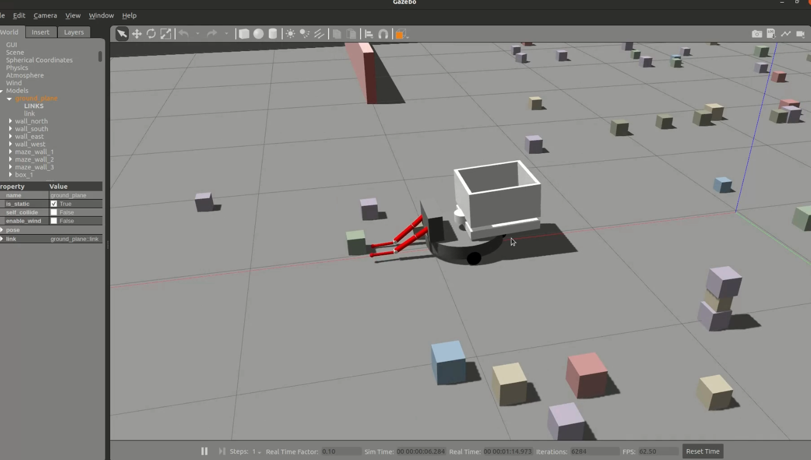

# GPU‑SLAM Bot — Starter Project (ROS2, C++, CUDA, Gazebo)

A minimal, end‑to‑end template to simulate a robot in Gazebo and build a real‑time, GPU‑accelerated 2D SLAM pipeline. It subscribes to sensor_msgs/LaserScan, integrates scans into a log‑odds occupancy grid on the GPU, and publishes nav_msgs/OccupancyGrid. Gazebo SDF world is set with a flat ground plane and a sun.

## Scope: mapping only (no loop closure). Easy to extend into FastSLAM (particles on GPU) or ICP/scan‑matching later.

### 1) System Architecture

- Gazebo Sim → publishes /scan (LiDAR) and /tf

- gpu_slam_node (ROS2 C++ + CUDA)

Subscribe: /scan (sensor_msgs/msg/LaserScan)

(Optional) Subscribe: /tf for robot pose (or use odom)

GPU kernels:

Ray integration kernel: cast each beam, mark freespace and endpoint occupied (atomicAdd log‑odds)

Publish: /map (nav_msgs/msg/OccupancyGrid)

- RViz2 → visualize /map

### 2) Directory Layout

```
ws/
 ├─ src/
 │   └─ gpu_slam_bot/
 │       ├─ CMakeLists.txt
 │       ├─ package.xml
 │       ├─ include/
 │       │   └─ gpu_slam_bot/
 │       │       ├─ gpu_grid.hpp
 │       │       └─ auto_move.hpp         
 │       ├─ src/
 │       │   ├─ gpu_grid.cu
 │       │   ├─ gpu_slam_node.cpp
 │       │   ├─ auto_move.cpp  
 │       │   └─ ...         
 │       ├─ launch/
 │       │   └─ sim.launch.py
 │       ├─ config/
 │       │   └─ diff_drive_controllers.yaml
 │       ├─ urdf/
 │       │   └─ gpu_slam_bot.urdf.xacro
 │       ├─ models/
 │       │   └─ box.sdf
 │       └─ worlds/
 │           ├─empty_lidar.world
 │           └─ ... 
 ├─ build/       (generated after colcon build)
 ├─ install/     (generated after colcon build)
 └─ log/         (generated after colcon build)
```

### 3) Build Prereqs

- ROS2 Foxy (or newer)

- CUDA 11+ (works on most modern NVIDIA GPUs)

- CMake ≥ 3.18 (for first‑class CUDA language)

- Gazebo (Fortress/Garden) or classic Gazebo; adjust launch accordingly

```bash
which gazebo

# If not install, try something like this (adjust to yours accordingly):

sudo apt update

sudo apt install ros-foxy-gazebo-ros-pkgs ros-foxy-gazebo-ros2-control

sudo apt install ros-foxy-teleop-twist-keyboard # make it move

```


### 4) To Run:

```bash

cd ws

source /opt/ros/foxy/setup.bash # Replace foxy with your version, e.g. source /opt/ros/humble/setup.bash

colcon build --symlink-install # Build the workspace with CUDA support

```

Generate URDF:

```bash
cd ws/src/gpu_slam_bot

ros2 run xacro xacro urdf/gpu_slam_bot.urdf.xacro -o urdf/gpu_slam_bot.urdf


# Spawn the robot in Gazebo
ros2 run gazebo_ros spawn_entity.py \
    -entity gpu_slam_bot \
    -file urdf/gpu_slam_bot.urdf


```

If CUDA is not found, you might need to set: 

```bash

colcon build --symlink-install --cmake-args -DCMAKE_CUDA_COMPILER=/usr/local/cuda/bin/nvcc

```

After a successful build:

```bash

source install/setup.bash

```

Run the launch file: 

```bash

cd ws

<del>chmod +x src/gpu_slam_bot/gpu_slam_bot/autonomous_drive.py</del>  # using C++ instead
<del>chmod +x src/gpu_slam_bot/gpu_slam_bot/auto_move.py</del> # using C++ instead
chmod +x launch_sim.sh

./launch_sim.sh

```


Extra checks:

```bash

nvcc --version #Verify CUDA

ros2 pkg list | grep gpu_slam_bot #Verify package is found


```

If your `colcon build` doesn't work, try `colcon list`, if it prints nothing even in a clean workspace, it means ROS 2 cannot detect packages — most likely because of your Conda (base) environment interfering with ROS 2 Python packages.

```bash

conda deactivate


```

Then source ROS2 again.

If you are dealing with “0 packages” trap with colcon in Unbuntu, try this:

```bash

# Optional: remove old pip installation if any
pip3 uninstall colcon-common-extensions

# Reinstall colcon via pip
pip3 install --user colcon-common-extensions

```


